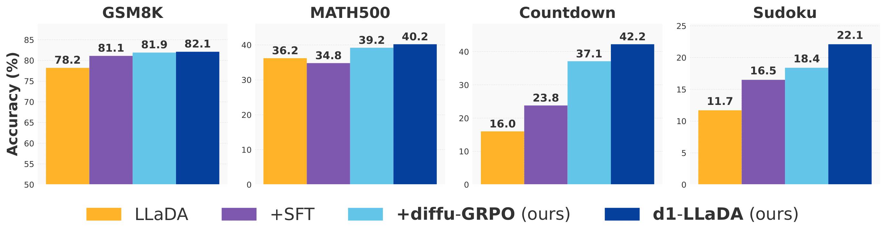
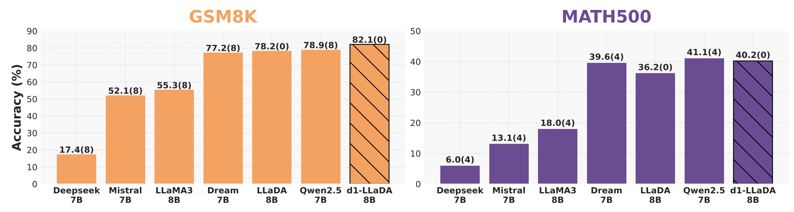
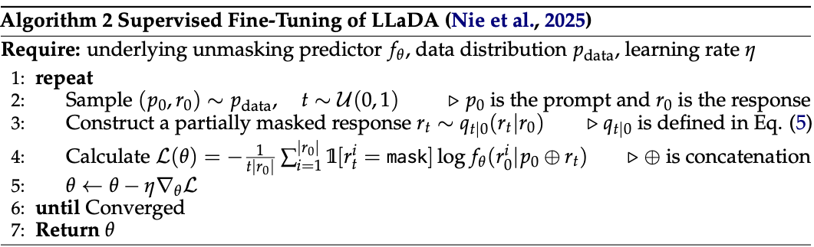

<div  align="center">
    <h1>d1: Scaling Reasoning in Diffusion Large Language Models via Reinforcement Learning</h1>
  <p>A two-stage approach combining masked SFT with <i>diffu</i>-GRPO—a novel policy gradient method based on GRPO that features efficient log probability estimation designed for masked dLLMs—to scale reasoning capabilities in pre-trained diffusion Large Language Models</p>
</div>






<div align="center">
  <hr width="100%">
</div>

**Updates:**

* 04-11-2025: We released [our paper](https://dllm-reasoning.github.io/media/preprint.pdf) and [project page](https://dllm-reasoning.github.io). Additionally, the SFT code was open-sourced.

<div align="center">
  <hr width="100%">
</div>


### SFT

We open-source our code to perform completion-only masked SFT for dLLMs. We implement the algorithm proposed in [LLaDA](https://github.com/ML-GSAI/LLaDA), and also provide it below for completeness.



The framework follows a similar interface to 🤗 Transformers. `dLLMTrainer` subclasses `Trainer` and overrides the loss computation to implement the diffusion loss. `dLLMDataCollator` extends `DefaultDataCollator` by incorporating a forward noising process applied to each training batch. Additionally, we provide a custom torch dataset, `dLLMSFTDataset`, tailored for completion-only SFT of dLLMs.

To preprocess and tokenize your dataset, you will need to modify `preprocess_dataset`. Presently, it works with the s1K dataset.

SFT results can be reproduced with the command,
```
CUDA_VISIBLE_DEVICES=0,1,2,3 accelerate launch --config_file ddp_config.yaml --main_process_port 29500 --num_processes 4 sft_train.py
```

### _diffu_-GRPO
Code coming soon!

### Eval
Code coming soon!

